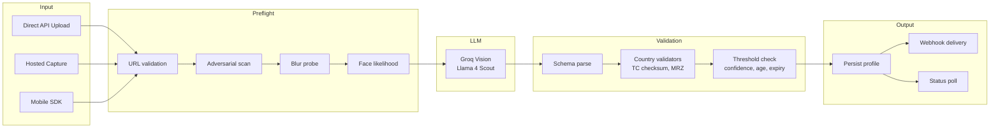

# KYC Flow Overview

High-level view of the Armith KYC verification pipeline, covering all supported verification types and integration patterns.

## Product Scope

### Supported today

- REST API verification (ID + selfie + eID NFC)
- AI-powered document extraction and face matching via Groq LLM
- Deterministic preflight (blur, adversarial checks) before LLM
- Hosted capture pages for web and mobile channels
- React Native SDK for native mobile capture
- Outbound webhooks with HMAC signing and multi-webhook fan-out
- KYB (Know Your Business) entity verification
- AML/sanctions/PEP screening
- Async verification with BullMQ queue
- Sandbox testing with deterministic scenarios
- Manual review queue with auto-escalation, assignee, and SLA tracking
- Configurable verification workflows (ordered steps)
- Admin analytics, audit log, and data subject rights (GDPR)
- Multi-tenant dashboard with role-based access (RBAC)
- Config presets (strict, balanced, lenient)
- Idempotency keys on all verification writes

### Not supported today

- Drop-in web UI widget (use hosted capture pages)
- Additional biometric liveness vendors (current: Groq LLM-based)
- Document type detection (passport, residence permit — roadmap)

## Integration Patterns

| Pattern | Effort | Docs |
|---------|--------|------|
| **Direct REST API** | Build your own capture UI | [Step-by-Step API Flow](/kyc-api-flow) |
| **Hosted Capture Pages** | Redirect-based, low effort | [Integrator Hosted Flow](/integrator-hosted-flow) |
| **Mobile SDK** | React Native native flow | [Mobile SDK](/mobile-sdk) |

## Verification Pipeline



## Verification Types

### ID Card Verification (`POST /kyc/id-check`)

1. Upload front (+ optional back) via `POST /kyc/upload-url`
2. Preflight: URL validation → adversarial heuristics → blur probe
3. Load tenant config, compile YAML prompt for country
4. Call Groq vision LLM with images
5. Server pipeline: schema parse → placeholder/fake-data penalties → country validator (e.g. TR TC checksum) → age/expiry rules → confidence thresholds → MRZ cross-check
6. **Critical errors → REJECTED; warnings only → still APPROVED**
7. If ID passes and selfie is required → profile stays **PENDING** until selfie completes

### Selfie Verification (`POST /kyc/selfie-check`)

1. Upload selfie; send `profileId`, `idPhotoUrl` (ID front portrait), and `selfieUrls`
2. Compile selfie prompt, send ID portrait + selfie to Groq
3. Server pipeline: schema parse → `evaluateSelfieRules()` (match %, spoofing, liveness, quality, lighting, face size/coverage)
4. **Any validation error → REJECTED** (stricter than ID)
5. Overall profile status: both checkpoints must pass for **APPROVED**

### eID NFC Verification (`POST /kyc/eid-check`)

Cryptographic verification of embedded chip data against visual document fields:

1. Mobile app reads eID chip via NFC
2. Chip data submitted to Armith for validation
3. Server validates: chip authentication, SOD signature, document data match, visual data match
4. Combined authenticity score computed from cryptographic + visual checks

See [eID NFC Verification](/eid-nfc-verification).

### KYB — Business Verification (`/kyb/*`)

Know Your Business entity verification:

- Create KYB profiles with legal name, registration number, jurisdiction
- Link related person KYC profiles (directors, beneficial owners)
- Track verification status per entity
- API key or Clerk auth

See [KYB Verification](/kyb-verification).

## Screening (AML/Sanctions/PEP)

Optional screening step after ID verification:

| Provider | Type | Status |
|----------|------|--------|
| OpenSanctions | Sanctions + PEP | Active |
| Diligence | Screener | Configurable |
| ComplyAdvantage | Sanctions + PEP | Configurable |

Screening results are stored on the profile: `screening.status`, `screening.hits`, `screening.sanctionsMatch`, `screening.pepMatch`.

See [Screening](/screening).

## Async Verification

Verification can run synchronously (default) or asynchronously via BullMQ:

- **Sync:** Request → preflight → LLM → validation → response
- **Async (`async: true`):** Request → preflight → enqueue → 202 Accepted → worker processes → webhook on completion

See [Async Verification](/async-verification).

## Status Model

### Checkpoint responses (`id-check`, `selfie-check`, `eid-check`)

Lowercase strings in the immediate API response:

| Status | Meaning |
|--------|---------|
| `approved` | Checkpoint passed |
| `rejected` | Business/security rule failed |
| `pending` | ID passed; selfie still required |
| `failed` | System/runtime failure |

### Profile status (`GET /kyc/status/:profileId`)

Uppercase persisted profile status:

| Status | Meaning |
|--------|---------|
| `APPROVED` | All required checkpoints passed |
| `REJECTED` | Validation failed |
| `FAILED` | System error |
| `PENDING` | Awaiting next required step |
| `UNDER_REVIEW` | Manual review queue (auto or operator-enqueued) |

## Decision Authority

The **server** makes the final approve/reject decision using:

- Tenant thresholds from `KycConfiguration`
- Deterministic validators (TC checksum, MRZ, age, expiry)
- LLM output (Groq vision model) as structured advisory input
- LLM-reported image quality capped by deterministic capture sharpness scores

## Verification Workflows

Tenants can define ordered verification pipelines with custom steps:

```json
{
  "steps": [
    { "id": "id-1", "type": "id", "required": true },
    { "id": "selfie-1", "type": "selfie", "required": true },
    { "id": "screening-1", "type": "screening", "required": false }
  ]
}
```

See [Verification Workflows](/workflows).

## Webhooks

Armith delivers HTTPS POST notifications on terminal and lifecycle events:

| Event | Trigger |
|-------|---------|
| `verification.completed` | Terminal success |
| `verification.failed` | Terminal failure |
| `verification.manual_review_queued` | Escalated to manual review |
| `verification.manual_review_resolved` | Manual review decision made |

See [Outbound Webhooks](/webhooks).
