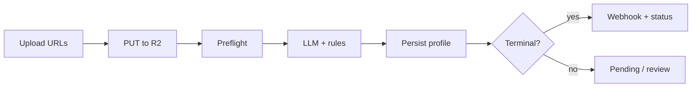

# KYC Flow Overview

High-level view of the current Armith KYC pipeline.

## Product Scope

**Supported today:**

- REST API verification (ID + selfie)
- Dashboard operations, settings, webhooks, API keys
- Outbound webhooks with HMAC signing
- Deterministic preflight (blur, adversarial checks) before LLM
- Manual review queue and auto-escalation

**Not supported today:**

- Official client SDKs
- Drop-in UI widgets (build your own capture UI or use dashboard demo)

## End-to-End Flow

### Step 1 — Discover capabilities

- `GET /kyc/countries` — supported country codes
- `GET /kyc/llm-status` — LLM provider readiness

### Step 2 — Upload URLs

`POST /kyc/upload-url` for each asset:

- `id-front` (required)
- `id-back` (country-dependent)
- `selfie`

Returns presigned `uploadUrl` and tenant-scoped `downloadUrl`.

### Step 3 — Upload bytes

`PUT` JPEG/PNG directly to `uploadUrl` with matching `Content-Type`.

### Step 4 — Preflight (automatic)

Before any LLM call, the backend validates:

- URL reachability and R2 HEAD metadata
- Image size, MIME, optional min resolution
- **Adversarial heuristics** on raw bytes
- **Laplacian blur score** vs tenant `minCaptureSharpness` (default 0.38)
- Selfie **face likelihood** heuristic

Failures return `400` with codes like `BLURRY_IMAGE`, `ADVERSARIAL_IMAGE_DETECTED`, `NO_FACE_DETECTED`.

See [Verification & Preflight](/verification-and-preflight).

### Step 5 — ID verification

`POST /kyc/id-check` with image URLs and `countryCode`.

Outputs:

- `profileId` (save this)
- Checkpoint `idStatus` / overall `status`
- Extracted fields and confidence scores
- Optional `integrationExternalRef` / `integrationMetadata` for webhooks

**ID checkpoint is lenient:** warnings may still approve; only **critical** errors reject.

### Step 6 — Selfie verification

`POST /kyc/selfie-check` with `idPhotoUrl`, `selfieUrls` (1–5), and `profileId` when both steps are required.

**Selfie checkpoint is strict:** any validation error → rejected.

### Step 7 — Status / webhooks

- Poll: `GET /kyc/status/:profileId` or `GET /kyc/sessions/:id`
- Push: outbound webhooks on terminal and manual-review events

### Step 8 — Operationalize

- Log `profileId` and `correlationId`
- Handle `UNDER_REVIEW` in ops workflows
- Use `Idempotency-Key` on retries
- Respect `outcomeSemantics` (`FINAL` vs `RETRY_SUGGESTED`) on terminal webhooks

## Status Model

### Checkpoint responses (`id-check`, `selfie-check`)

Lowercase strings in the immediate API response:

| Status | Meaning |
|--------|---------|
| `approved` | Checkpoint passed |
| `rejected` | Business/security rule failed |
| `pending` | ID passed; selfie still required |
| `failed` | System/runtime failure |

### Profile status (`GET /kyc/status/:profileId`)

Uppercase persisted profile status:

| Status | Meaning |
|--------|---------|
| `APPROVED` | All required checkpoints passed |
| `REJECTED` | Validation failed |
| `FAILED` | System error |
| `PENDING` | Awaiting next required step |
| `UNDER_REVIEW` | Manual review queue (auto or operator-enqueued) |

::: info
Always design integrations to handle both casings: checkpoint endpoints return lowercase; status endpoint returns uppercase profile `status`.
:::

## Decision Authority

The **server** makes the final approve/reject decision using:

- Tenant thresholds from `KycConfiguration`
- Deterministic validators (TC checksum, MRZ, age, expiry)
- LLM output (Groq vision model) as structured advisory input

LLM-reported image quality may be **capped** by deterministic capture sharpness scores.
